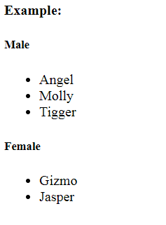
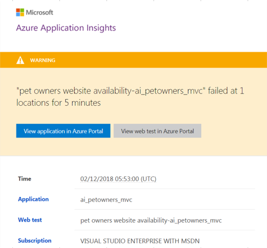
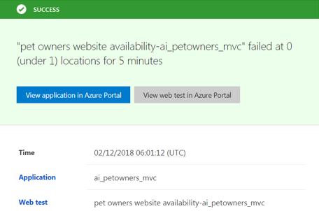
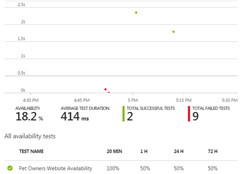
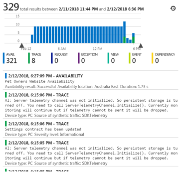

 # AGL Coding Challenge

This project has been commenced to submit some code to AGL Coding challenge.
The requirement is to write some code to consume the JSON result from API(http://agl-developer-test.azurewebsites.net/people.json), and output a list of all the cats' name in alphabetical order under a heading of the gender of their owner.

Required Output Example



## Technologies Used

The programming language is open to a developer, so I choosed technologies below to demonstrate my experience and knowledge with those techonologies.

* Approach: Onion Architecture for unit test friendly, easy to extend with it's loose coupling, and cross cutting concerns.
* Language: .net framework 4+ with MVC 5+ Web Application model along with jquery 3+, html 5 and css 3. 
* Dependency Injection: Unity 5+
* Testing: NUnit 3+, Moq 4+
* IDE: Visual Studio Enterprise 2017
* Deployment: Azure Web Application http://petownermvc.azurewebsites.net/
* Monitoring/Logging: Azure Application Insights

## Used Dll Versions

* jQuery v3.3.1
* Microsoft.ApplicationInsights v2.5.0
* Microsoft.AspNet.Mvc v5.2.3
* Microsoft.AspNet.Razor v3.2.3
* Microsoft.AspNet.WebPage v3.2.3
* Microsoft.CodeCoverage v1.0.3
* Microsoft.CodeDom.Provider.DotNetComplerPlatform v1.0.8
* Microsoft.Net.Compilers v2.6.1
* Microsoft.NET.Test.Sdk v15.5.0
* Microsoft.TestPlatform.TestHost v15.5.0
* Microsoft.Web.Infrastructure v1.0.0
* Moq v4.8.1
* Newtonsoft_Json 10.0.3
* NUnit v3.9.0
* NUnit.ConsoleRunner v3.8.0
* NUnit.Extension.NUnitProjectLoader v3.6.0
* NUnit.Extension.NUnitV2Driver v3.7.0
* NUnit.Extension.NUnitV2ResultWriter v3.6.0
* NUnit.Extension.TEeamCityEventListener v1.0.3
* NUnit.Extension.VSProjectLoader v3.7.0
* System.Diagnostics.DiagnosticSource v4.4.0
* System.Net.Http v4.3.3
* System.Security.Cryptography.Algorithms v4.3.1
* System.Security.Cryptography.Encoding v4.3.0
* System.Security.Cryptography.Primitives v4.3.0
* System.Security.Cryptography.X509Certificates v4.3.2
* Unity v5.5.8
* Unity.Abstractions v3.1.3
* Unity.Container v5.5.8
* Unity.Nvc v5.0.12
* WebActivatorEx v2.2.0

## Testing

 ### Unit
Unit Tests are set up and implemented using NUnit with Moq.

## Logging and Monitoring

Azure Application Insights provides proactive alert and monitoring mechanism.
Some simple monitoring and alert functions implemented for this project.

* Logging exceptions, alerts, and custom information
* Availability monitoring
* Performance monitoring

If you want to set up error logging and availability monitoring in Azure, you need to setup your own Application Insights on your own subscription. If you do not want to set them up for now, you can ignore, and the application runs regardless.

### Setup Availability Monitoring

1. Open Application Insights in Azure
2. Select Availability
3. Create new Test and configure to monitor

Alert email is sent to specified receiver when the web is not available.


Healthy email is sent to specified receiver when the web is back available.


Availability test result is accessible proactively in Azure Portal.


### Additional Custom Logging to Application Insights from MVC Web Application

1. Create new Application Insights or add Application Insights from Web Appliation.
```
New --> Search Application Insights --> Create Application Insights --> fill up information --> hit Create button 
```
2. Set Instrumentation Key in Configration file.
```
Properties --> INSTRUMENTATION KEY --> Copy to notepad
```
3. Set Instrumentation Key in Configration file in the MVC project in solution.
```
..\petowners\petowners\web.config --> <configuration> --> <appSettings> --> Update Value of "TelemetryKey"
```

Track and Tracing Sample




## Deployment

Publiched to: http://petownermvc.azurewebsites.net/
COnfiguration: Release

## Source Controll

GitHub: https://github.com/ahoso/PetOwners/

## Author

Akiko Hosonuma

## Copyright

This project is under Copyright @ Akiko Hosonuma 2018

